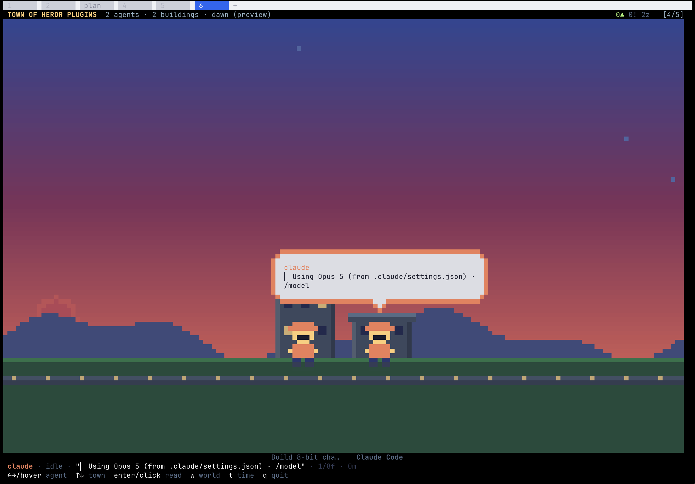
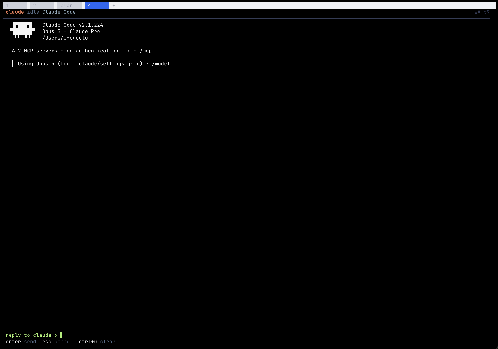
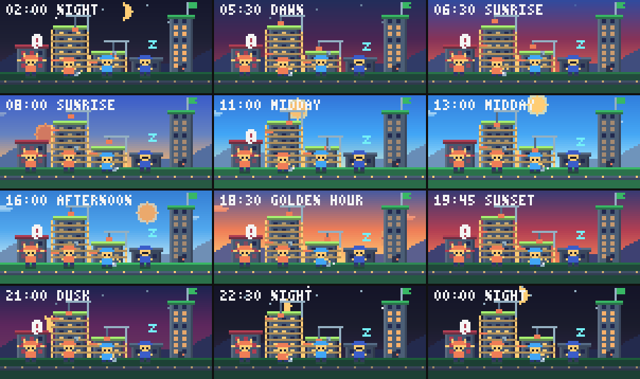
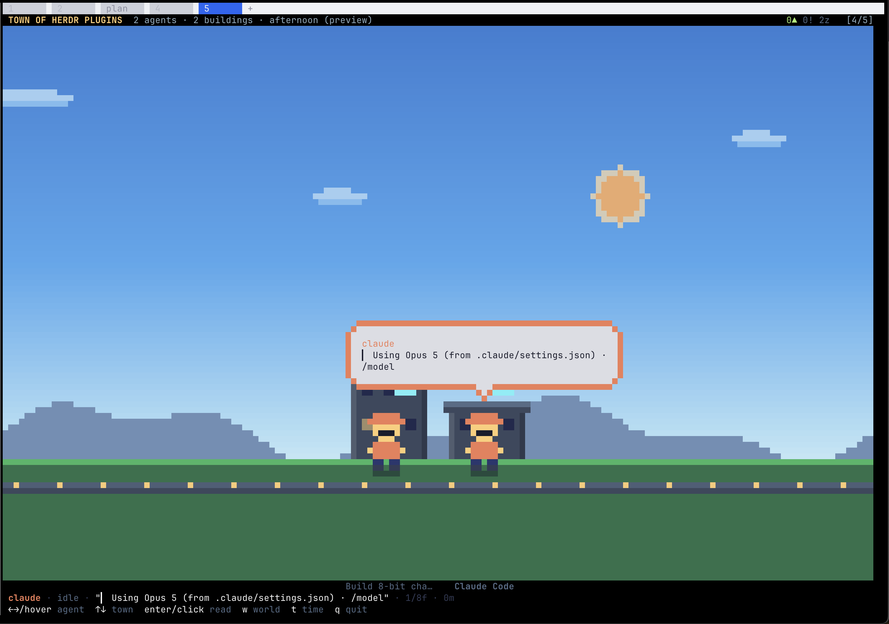
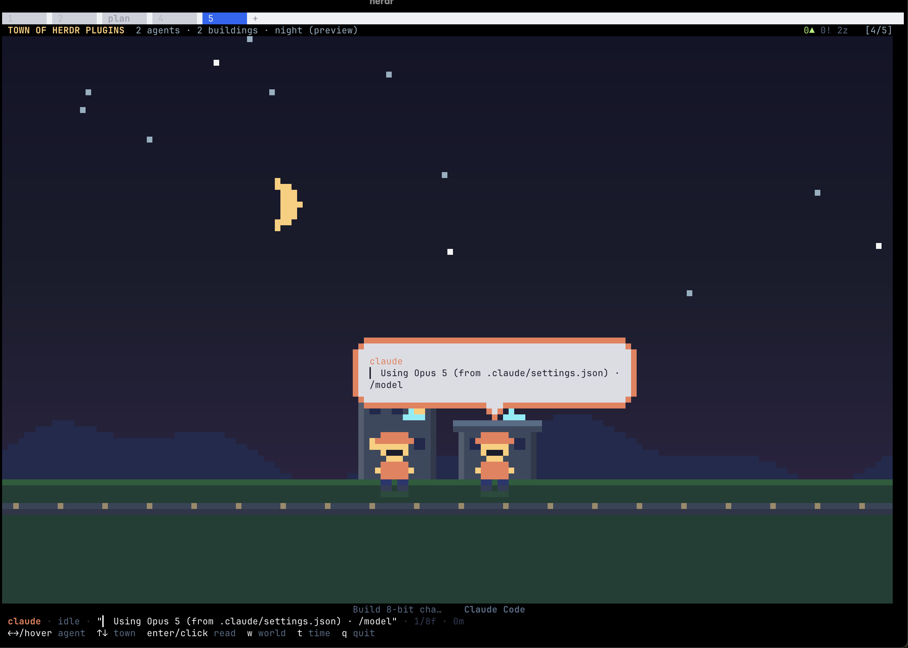
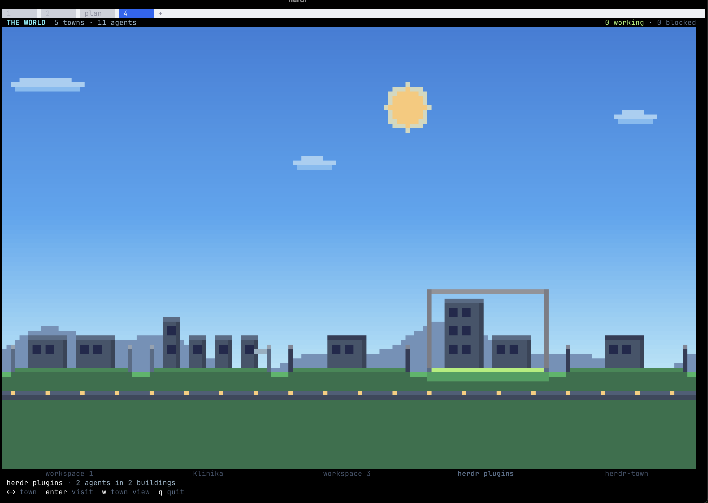

# Agent Town

A [Herdr](https://herdr.dev) plugin that renders your running coding agents as
an 8-bit town, and lets you read and answer them without leaving it.



Herdr already knows which agents are `working`, `blocked`, `done` or `idle`
across every project. Agent Town draws that as a place instead of a list, then
goes one step further: hover a worker and it tells you what it last said, press
`enter` to read the whole message, press `r` to answer it.

```bash
herdr plugin install Efeguclu1/herdr-town
herdr plugin pane open --plugin efeguclu.town --entrypoint town
```

## The idea

| Herdr concept | In the town |
| --- | --- |
| Workspace | A **town** |
| A feature being worked on | A **building** under construction |
| Agent in a pane | An 8-bit **worker** |
| `agent_status` | What the worker is doing |
| Time spent `working` | How many **floors** the building has |

Agents whose panes report the same task title are working on the same feature,
so they share a building and hammer at it side by side.

| State | Worker | Building |
| --- | --- | --- |
| `working` | Swings a hammer, sparks fly | Scaffolding, a swinging crane, flickering windows |
| `blocked` | Arms up under a pulsing red `!` | Hazard tape across the site, red windows |
| `done` | Celebrating in confetti | Fully lit, flag on the roof |
| `idle` | Asleep with floating `z`s | Dark, a couple of windows on |

## Read and answer, without leaving

The point of the town is that it replaces reading terminal scrollback. Hover a
worker and a speech bubble shows what it last said. Blocked agents always get
one, because a blocked agent is the reason you looked.

Press `enter` and the town gives way to the full message:

```
 claude blocked  QR handshake fix                                        w2:pF
──────────────────────────────────────────────────────────────────────────────
  I found two ways to fix the handshake.

  1. Patch the client to retry with the old token format. Small, contained,
     but leaves the shim in place for another release.
  2. Bump the library to 3.2 and delete the shim entirely. Cleaner, but it
     touches the reconnect path that the QR flow depends on.

  Which do you want?

 line 1-9 of 34
 ↑↓/wheel scroll  r reply  enter go to this agent  esc back  q quit
```

Press `r` and the footer becomes a composer:



That goes out through `herdr agent prompt`. The agent starts working, its
building sprouts scaffolding, and you never opened its pane.

## Time of day

The sky runs on your real clock, interpolated between keyframes so dawn creeps
in and sunset deepens rather than snapping between modes.



The sun and moon arc across the sky on the real clock, so the town tells you
roughly what time it is. Lit windows respond to the light: at midnight a lit
window glows, at noon it is just glass. Stars fade in as it darkens, and clouds
only appear while it is bright enough to see them.

| Afternoon | Night |
| --- | --- |
|  |  |

There is no way to change the time from inside the town, deliberately: the
sky is meant to tell you what time it actually is, and a town you can set to
midnight stops being informative. For development you can pin an hour, but it
has to go through `--env`:

```bash
herdr plugin pane open --plugin efeguclu.town --entrypoint town \
  --env HERDR_TOWN_HOUR=19.5
```

Herdr's server spawns plugin panes, so `HERDR_TOWN_HOUR=19.5 herdr plugin
pane open ...` does **not** work: the variable is set on the client, which
only sends a socket request, and never reaches the launched process.

## Every project at once

Press `w` for the world view: each project as its own town on its own plot, so
you can see across everything you are running.



A town with a blocked agent raises a `!` above its skyline, and the town you
have selected keeps a frame around its plot. A workspace with nothing built
yet shows open land rather than a placeholder building, so the map never
promises a town that the town view then shows as an empty field.

## The town remembers

Towns are not just a view of what is running right now. Every feature its
agents have worked on is remembered, so the skyline is a record of the project:

- **Finished** features stay standing as completed buildings, warm lit windows
  and a flag, no workers outside. Kept for 90 days.
- **Abandoned** features (worked on, never finished) stand as **ruins**:
  eroded rooflines, dark windows, rubble at the base. Kept for 14 days.
- Features touched for under a minute leave nothing behind, so glancing at an
  agent does not permanently alter the town.

Buildings grow with the time their agents spend in Herdr's `working` state:
one hour per floor, up to 8, so a maxed-out tower is seven hours of real work
on a single feature. Two agents on the same feature build it twice as
fast. An agent sitting idle at a prompt builds nothing, which is deliberate:
the skyline should reflect work done, not panes left open.

### The recorder

Progress is counted by a small background process, not by the view. If it were
counted while the town was on screen, buildings would only grow during the
minutes you happened to be watching.

The plugin's `[[startup]]` hook detaches the recorder when Herdr starts, and
opening the town starts one if none is running. It polls every 15 seconds,
holds a heartbeat lock so only one ever runs, and exits once Herdr has been
gone for about five minutes. It is the only writer of progress; the view opens
the store read-only.

```bash
node bin/recorder.js --spawn   # start one by hand
pgrep -fl bin/recorder.js      # check it is alive
pkill -f bin/recorder.js       # stop it (buildings stop growing)
```

## Controls

Herdr forwards mouse reports to plugin panes, including motion, so the town is
browsable with the pointer.

| Mouse | Does |
| --- | --- |
| **hover** a worker | Selects them; their bubble appears as you pass |
| **click** the selected worker | Opens the full message |
| **wheel** | Walks the workers; scrolls in the reading view |

| Key | Town view | World view |
| --- | --- | --- |
| `←` `→` / `h` `l` | Select a worker | Select a town |
| `↑` `↓` / `k` `j` | Switch town | — |
| `enter` | Read the full message | Enter the town |
| `w` / `tab` | World view | Back to town view |
| `m` | Release the mouse back to Herdr | Same |
| `r` | Refresh now | Refresh now |
| `q` / `esc` | Quit | Quit |

In the reading view: `↑↓`/wheel scroll, `r` reply, `enter` jump to that agent's
pane, `esc` back to the town, `q` quit. While composing a reply every key
belongs to the composer, so typing "q" writes a q instead of quitting.

## Terminal size

The town scales to the pane it is given. Terminal size decides how the town is
*drawn*, never what it contains: the number of buildings comes from your
agents and their history, and the number of floors comes from recorded working
time. A small terminal shows fewer buildings at once and you scroll; it does
not mean the town has fewer.

| terminal | storey | worker | bubble | buildings on screen |
| --- | --- | --- | --- | --- |
| 80x24 | 3px | 12px | 25 chars | 4 |
| 100x30 | 3px | 12px | 32 chars | 5 |
| 120x40 | 5px | 12px | 38 chars | 6 |
| 161x50 | 6px | 12px | 46 chars | 8 |
| 200x60 | 8px | 12px | 46 chars | 10 |

Storey height is derived so that a maxed-out 8-floor tower exactly fills the
sky below the space reserved for speech bubbles, and sprite scale follows
storey height so a worker stays about a storey and a half tall at any size.
Both were once chosen independently, which made floors 5-8 render identically
on a 161x50 pane and left workers 43% as tall as a full tower.

Below 100x30 there is genuinely not enough sky for eight distinct storeys, so
floors compress: 80x24 shows 6 of the 8 as distinct heights.

## Install

```bash
herdr plugin install Efeguclu1/herdr-town
```

Or to work on it locally:

```bash
git clone https://github.com/Efeguclu1/herdr-town
herdr plugin link ./herdr-town
```

No build step and no dependencies, just Node 16+. The town opens as a **tab**
so it survives jumping to an agent: press `enter` from the reading view and
focus moves to that agent's pane while the town keeps running behind it.

Bind it to a key in your Herdr config:

```toml
[[keys.command]]
key = "prefix+t"
type = "plugin_action"
command = "efeguclu.town.open"
description = "agent town"
```

Opened from a workspace, it starts on that workspace's town.

## How it works

Herdr has no plugin SDK. The CLI *is* the API, so this polls `herdr agent list`
and `herdr workspace list` once a second through `HERDR_BIN_PATH` (which works
over both Unix sockets and Windows named pipes) and animates at ~12fps between
polls.

Rendering uses the half-block trick: each terminal cell draws `▀` with one
colour as the foreground and another as the background, giving two square
pixels per cell and a real pixel-art canvas at 2× the row resolution. Colours
come from the 16-colour Sweetie-16 palette, which is most of why it reads as
8-bit rather than as a terminal with colours in it.

Speech bubbles are a pixel frame around **real terminal text**. A canvas column
is exactly one terminal column, so text composites into the scene at full font
resolution: readable at sentence length, and one line costs 2 pixel rows
instead of the 7 a pixel font would need.

Reading an agent's message is deliberately dumb. Claude Code and Cursor paint
different screens but the same *shape*: `<transcript> RULE <input box> RULE
<status>`. Finding the trailing cluster of box-drawing rules and cutting there
handles both with no per-agent parser, which matters because Herdr supports
15+ agent CLIs.

| Module | Does |
| --- | --- |
| `src/canvas.js` | Pixel canvas, text cells, ANSI renderer |
| `src/scene.js` | Sky, buildings, workers, bubbles, layout |
| `src/daylight.js` | Day cycle: keyframed sky, sun and moon arcs |
| `src/message.js` | Reading agent screens and stripping chrome |
| `src/world.js` | Herdr snapshot to towns, buildings, workers |
| `src/store.js` | Persistent build progress and town history |
| `src/mouse.js` | SGR mouse reports |
| `src/font.js` | 3x5 bitmap font for in-world labels |

Dev tools, not part of the runtime:

```bash
node tools/preview.js out.png town 6 0 19   # render a scene to a PNG at 19:00
node tools/daysheet.js out.png              # the whole day as one contact sheet
node tools/message-test.js                  # what the extractor pulls from every agent
node tools/mouse-probe.js                   # does this terminal forward mouse events
```

Screenshots are real terminal captures. The day-cycle contact sheet is the one
exception: twelve hours cannot be photographed in one sitting, so it is
rendered by `tools/daysheet.js`, which approximates in-bubble text with the
bundled 3x5 font.

The captures predate a round of sizing work, so towns in them sit lower in the
frame and workers are larger relative to buildings than they now render. The
behaviour they show is otherwise current.

## Testing against your agent

Herdr supports 19 agent CLIs. This repo has fixtures for the shapes its author
could actually capture, so if the town shows nonsense for your agent, the fix
starts with a capture:

```bash
npm test                                    # run the extractor over every fixture
node tools/capture.js w2:pF codex-blocked   # save your agent's screen as a fixture
```

A fixture is raw `herdr agent read --source visible` output. The extractor has
no per-agent branches, so every fixture is checked by the same rules: a message
comes out, no box rules or prompt lines or token counters survive, and the
teaser a bubble would show contains real words rather than furniture.

**Check a capture for anything private before attaching it** — it is a verbatim
snapshot of what that agent had on screen. The fixtures in this repo carry real
chrome with invented content for that reason.

Sending a capture is the single most useful contribution: it turns an untested
agent into a tested one.

## Known limitations

- **Verified against Claude Code and Cursor.** Those are the agents the author
  runs. The extractor is structural rather than per-agent, and there is a
  fixture covering agents that draw no input box at all, but the other 16 CLIs
  Herdr supports are untested. See above for how to fix that in one command.
- **Sized for wide terminals.** Everything scales off canvas width. Below about
  100 columns bubbles get cramped.
- **Sunrise and sunset are fixed** at 06:12 and 19:36 year-round rather than
  computed from your latitude and date.
- Built and tested against **Herdr 0.7.5**.

Pane graphics (`pane.graphics.*`) could render true images instead of
half-blocks, but they are experimental and require
`[experimental].kitty_graphics = true`, so this sticks to half-blocks and works
everywhere. Herdr's `pane.agent_status_changed` event is scoped to one pane, so
a view spanning every workspace polls rather than subscribing; the animation
loop needs to tick regardless.

## Licence

MIT
